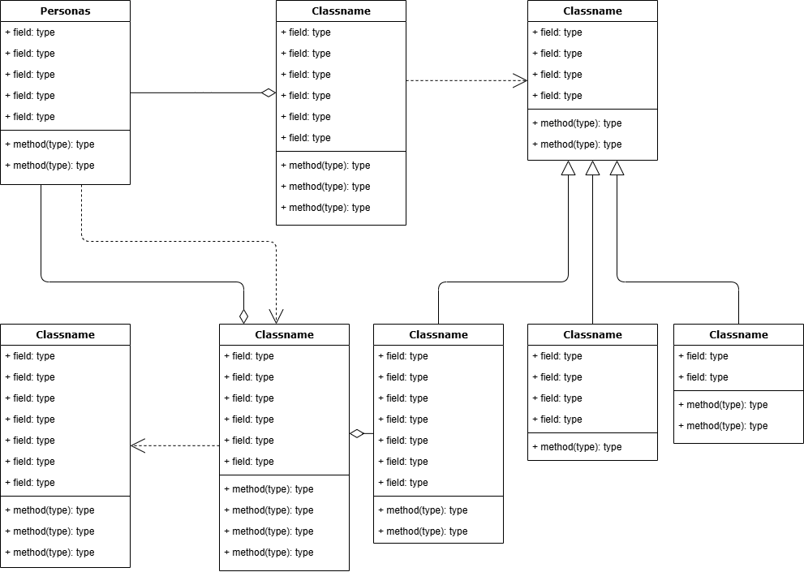
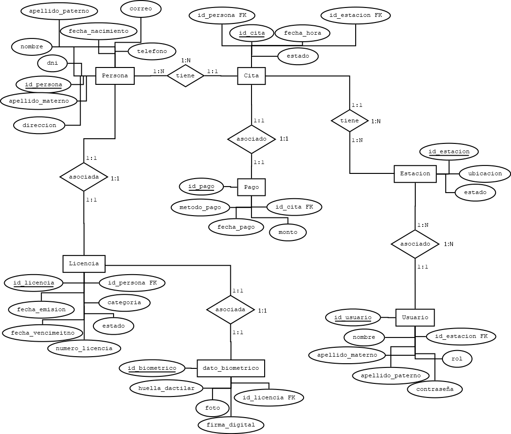

# 🛂 Sistema de Licencias de Manejo

Este proyecto representa el diseño y modelado de un sistema de licencias de manejo utilizando PostgreSQL. Incluye el modelo entidad-relación (E-R), scripts SQL para la creación e inserción de datos, y consultas de ejemplo.

---

## 🧠 Descripción General del Sistema

El sistema de licencias de manejo permite gestionar de manera eficiente:

- El registro de personas solicitantes.
- La gestión de citas.
- Pagos en línea asociados a citas.
- Administración de estaciones de trabajo y usuarios del sistema.

El modelo se encuentra **normalizado** y respeta las buenas prácticas de diseño con nombres de tablas en minúsculas y singular.

---

## 📊 Diagramas

### 📌 Modelo Entidad-Relación (E-R)

---

### 📌 Diagrama de Tablas

---

## 💾 Scripts SQL

Los archivos `.sql` están organizados por etapas:

| Archivo | Descripción |
|--------|-------------|
| `1.- Crear BD.sql` | Contiene las sentencias `CREATE TABLE` con relaciones y restricciones. |
| `2.- Insert-Datos.sql` | Inserciones de ejemplo para poblar las tablas. |
| `3.- Consultas.sql` | Consultas SQL ilustrando búsquedas comunes dentro del sistema. |

---

## 📃 Descripción del Modelo

Puedes consultar la explicación completa de entidades y relaciones en el archivo: [`descripcion-modelo.md`](./descripcion-modelo.md)

---

## 🧑‍🎓 Autor

Este proyecto fue desarrollado como parte de una actividad final en un curso de bases de datos relacionales (PostgreSQL).

---
